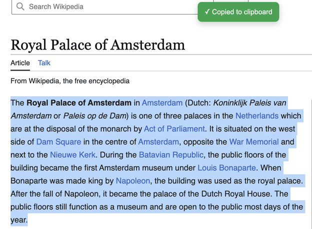

# Auto Copy 📋

[](manifest.json)
[](https://www.google.com/chrome/)
[](manifest.json)

A lightweight, high-performance Google Chrome extension (Manifest V3) that automatically copies selected text directly to your clipboard the moment you highlight it, while maintaining a clean, accessible history of your recent clips.

---

## 📸 Demo

<p align="center">
  
</p>

---

## ✨ Features

- **⚡ Instant Auto Copy**: Automatically writes highlighted text to the system clipboard after a customizable debounce delay (default: 500ms)—zero extra clicks, no keyboard shortcuts needed.
- **🕒 Clipboard History Tracker**: Keeps your last 5 copied snippets with relative timestamps. Re-copy any snippet with a single click or delete individual entries.
- **🔔 Visual Toast Feedback**: Shows a clean, non-intrusive on-screen toast confirmation whenever text is copied or settings change.
- **🚫 Duplicate Prevention**: Intelligently skips copying identical text consecutively, preventing redundant clipboard writes.
- **🌐 Granular Website Access Control**:
  - **Allow on all websites**: Run auto-copy across the entire web.
  - **Allow only selected websites**: Whitelist mode that restricts auto-copying strictly to specified domains, with 1-click domain toggle.
- **🏷️ Dynamic Badge & Icon Status**: Real-time toolbar icon status and badge indicator (`ON` in green / `OFF` in gray) reflecting active site permissions and global toggle.
- **⌨️ Global Keyboard Shortcut**: Instantly toggle auto-copy on or off without opening the popup:
  - **macOS**: `Command + Shift + Y`
  - **Windows / Linux**: `Ctrl + Shift + Y`
- **🔄 Device Synchronization**: Settings automatically synchronize across logged-in Chrome browser instances via `chrome.storage.sync`.

---

## 🌐 Compatibility

| Browser | Minimum Version | Status |
| :--- | :--- | :--- |
| **Google Chrome** | Chrome 88+ | Full Support (Manifest V3) |
| **Brave Browser** | Chromium 88+ | Full Support |
| **Microsoft Edge** | Edge 88+ | Full Support |
| **Opera / Arc / Vivaldi** | Chromium 88+ | Full Support |

---

## 🚀 Installation

### Option 1: Chrome Web Store (Recommended)

> *[Install from Chrome Web Store](#)* *(Link placeholder — coming soon upon store release)*

---

### Option 2: Load Unpacked (Manual / Developer Mode)

1. **Clone or Download** this repository:
   ```bash
   git clone https://github.com/kprakash18/Autocopy-extension.git
   ```
   *(or download and extract the ZIP file)*

2. Open Google Chrome and navigate to:
   ```text
   chrome://extensions/
   ```

3. Enable **Developer mode** via the toggle switch in the top-right corner.

4. Click **Load unpacked** in the top-left corner.

5. Select the `Autocopy` root folder (the directory containing [`manifest.json`](manifest.json)).

6. Pin **Auto Copy** to your extensions toolbar for easy access.

---

## 🛠️ How to Use

### 1. Auto Copying Text
- Highlight any text on a supported webpage using your cursor or keyboard.
- Once selection stops (after 500ms debounce), the text is copied directly to your clipboard and a toast appears.

### 2. Managing Clipboard History
- Click the **Auto Copy** extension icon in your browser toolbar.
- The **Clipboard History** tab lists your recent snippets.
- Click the **Copy icon** next to any item to copy it back to your clipboard.
- Click the **Delete icon** to remove an item, or click **Clear** to empty the entire history.

### 3. Customizing Settings
- Click the **Settings icon (⚙)** in the popup header.
- Toggle options:
  - **Auto Copy**: Master enable/disable switch.
  - **Notifications**: Show/hide on-page toast popups.
  - **Prevent Duplicates**: Skip copying identical consecutive selections.
  - **Clipboard History**: Enable or disable local history logging.

### 4. Website Access (Whitelist Mode)
- In Settings, click **Website Access ›**.
- Choose:
  - **Allow on all websites**
  - **Allow only selected websites** (Whitelist)
- Click **+ Allow this website** to add the current tab's domain, or click **×** to remove existing domains.

---

## 🔒 Permissions & Privacy

Privacy is a core design principle of Auto Copy. **No data ever leaves your browser.**

| Permission | Justification & Scope |
| :--- | :--- |
| `clipboardWrite` | Required to write the text you highlight directly into your system clipboard. |
| `storage` | Stores your extension preferences in `chrome.storage.sync` and recent clipboard snippets locally in `chrome.storage.local`. |
| `tabs` | Reads the active tab URL solely to update the toolbar status badge (`ON`/`OFF`) and evaluate website access whitelist rules. |
| `<all_urls>` | Allows the content script to run on web pages. **Note:** The script *strictly* listens for user-initiated `selectionchange` events on text you highlight. It **does not** read unselected page content, track keystrokes, access form data/passwords, or transmit any data externally. |

---

## 📂 Project Structure

```text
Autocopy/
├── manifest.json         # Extension Manifest V3 configuration
├── background.js        # Background service worker (badge, icons, commands, tabs)
├── icons/               # Toolbar & store icons (enabled & disabled states)
│   ├── icon-enabled-16.png
│   ├── icon-enabled-32.png
│   ├── icon-enabled-48.png
│   ├── icon-enabled-128.png
│   ├── icon-disabled-16.png
│   ├── icon-disabled-32.png
│   ├── icon-disabled-48.png
│   └── icon-disabled-128.png
├── popup/               # Extension popup interface
│   ├── popup.html       # Popup layout (History, Settings, Website Access)
│   ├── popup.css        # Clean, modern UI styling
│   └── popup.js         # Popup logic, history management & DOM controllers
├── content/             # Injected content scripts
│   └── content.js       # Debounced selection listener & clipboard bridge
├── styles/              # Injected page styles
│   └── toast.css        # Toast notification styling
├── utils/               # Modular helper functions
│   ├── constants.js     # Default settings & configuration limits
│   ├── storage.js       # chrome.storage sync/local abstraction
│   ├── clipboard.js     # Clipboard write utility
│   ├── debounce.js      # Debounce event helper
│   ├── toast.js         # Toast DOM injector & notification helper
│   └── siteAccess.js    # Domain matching & permission utilities
├── autocopy.gif         # Extension demo animation
└── README.md            # Project documentation
```

---

## ⌨️ Customizing Keyboard Shortcuts

To change the default keyboard shortcut:
1. Open Chrome and go to `chrome://extensions/shortcuts`.
2. Locate **Auto Copy**.
3. Click the pencil icon next to **Toggle Auto Copy** and press your desired shortcut combination.
